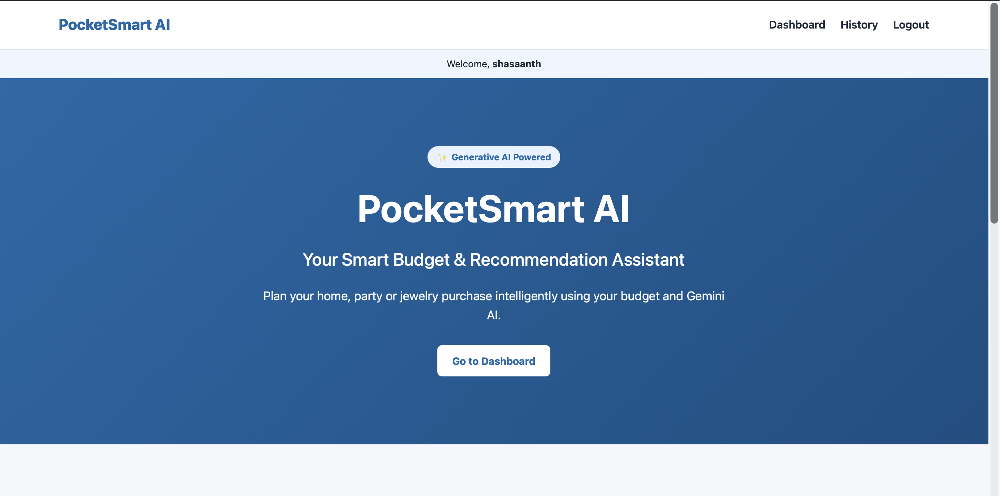
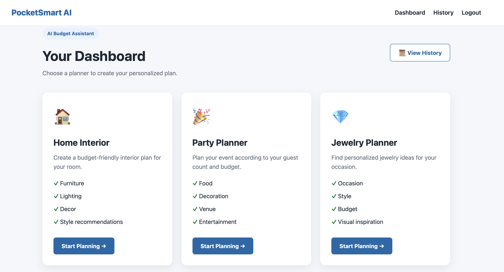
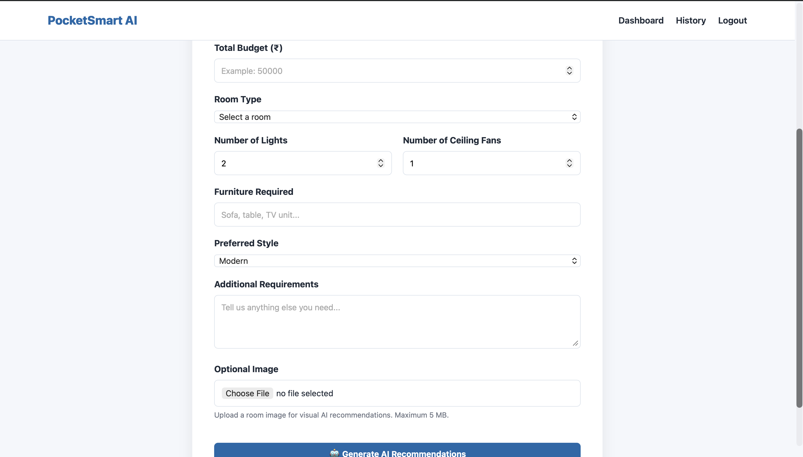
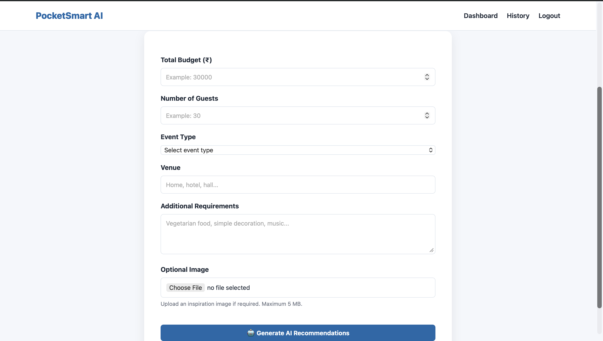
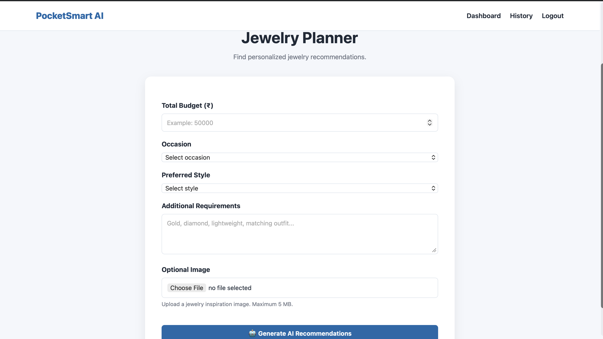
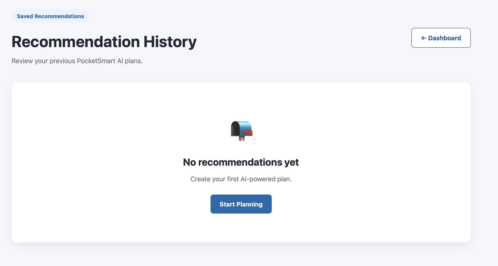

# PocketSmart AI

## Your Smart Budget & Recommendation Assistant

PocketSmart AI is a Generative AI-powered budgeting and recommendation assistant that helps users plan their spending for different real-world needs such as **home interiors, parties, and jewelry shopping**.

The application uses Google's Gemini API to generate personalized recommendations based on the user's budget, requirements, preferences, and optional uploaded images.

---

## Project Overview

Managing a budget while selecting suitable products and ideas can be difficult because users need to compare multiple options while staying within their spending limit.

PocketSmart AI addresses this problem by combining:

- Generative AI
- Budget planning
- Personalized recommendations
- Optional image input
- User authentication
- Recommendation history

The application provides AI-generated suggestions while keeping the user's specified budget as an important constraint.

---

## Key Features

### 🏠 Home Planner

Users can enter:

- Total budget
- Room type
- Preferred style
- Color preferences
- Additional requirements
- Optional reference image

Gemini generates a personalized home interior recommendation with estimated costs and suggestions.

### 🎉 Party Planner

Users can provide:

- Budget
- Number of guests
- Type of party
- Location
- Theme
- Food requirements
- Decoration preferences

The AI generates a suitable party plan based on the available budget.

### 💎 Jewelry Planner

Users can specify:

- Budget
- Jewelry type
- Occasion
- Preferred style
- Material preference
- Additional requirements

Gemini generates personalized jewelry recommendations while considering the user's budget.

### 💰 Budget Allocation

The application organizes the available budget into different categories and provides an estimated spending breakdown.

### 🖼️ Image Input

Users can optionally upload an image as a reference for their requirement.

Supported image formats include:

- JPG
- JPEG
- PNG
- WEBP

### 👤 User Authentication

The application provides:

- User registration
- Login
- Logout
- Password hashing
- Session-based authentication

### 📜 Recommendation History

Previous AI-generated recommendations can be stored and viewed through the History page.

---

## Technology Stack

| Technology | Purpose |
|---|---|
| Python | Backend programming |
| FastAPI | Web application backend |
| Jinja2 | HTML template rendering |
| HTML | Frontend structure |
| CSS | Frontend styling |
| JavaScript | Frontend interactions |
| Gemini API | Generative AI recommendations |
| JSON | Local data storage |
| Uvicorn | Application server |
| Git & GitHub | Version control |

---

## System Architecture

```text
                ┌──────────────────────┐
                │      User Browser    │
                └──────────┬───────────┘
                           │
                           ▼
                ┌──────────────────────┐
                │    FastAPI Backend   │
                │       app.py         │
                └──────────┬───────────┘
                           │
             ┌─────────────┼─────────────┐
             │             │             │
             ▼             ▼             ▼
       Authentication   Budget       File Upload
             │          Processing         │
             │             │             │
             └─────────────┼─────────────┘
                           │
                           ▼
                ┌──────────────────────┐
                │    Gemini API        │
                │ Generative AI Model  │
                └──────────┬───────────┘
                           │
                           ▼
                ┌──────────────────────┐
                │ AI Recommendation    │
                │      Results         │
                └──────────┬───────────┘
                           │
                           ▼
                ┌──────────────────────┐
                │ Recommendation       │
                │ History              │
                └──────────────────────┘


## Screenshots

### Home Page


### Dashboard


### Home Planner


### Party Recommendation


### Jewelry Planner


### Recommendation History
